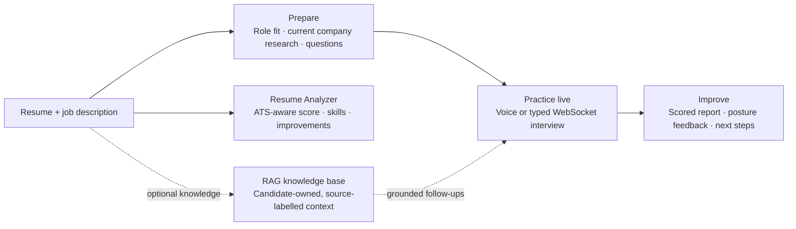

# HUSTLRZZ V2

### Your private, real-time AI mock interview coach

> Prepare from your own resume. Practice with a live AI interviewer. Improve what you say — and how you say it.

[**Launch the live app ↗**](https://frontend-deepaklearn7878-6255s-projects.vercel.app) &nbsp;·&nbsp;
[Backend health ↗](https://hustlrzzv2-production.up.railway.app/health) &nbsp;·&nbsp;
[Explore the code](https://github.com/dgexplores/hustlrzzv2)

[Launch readiness, privacy boundaries, and rollout gates](docs/LAUNCH_READINESS.md)

---

## The problem

Interview preparation is usually fragmented: static question banks do not know
the candidate, generic tools cannot probe a real answer, and most feedback
ignores confidence, posture, and delivery.

**HUSTLRZZ V2 closes that gap.** It turns a resume and job description into a
focused practice plan, conducts a conversational mock interview, and gives the
candidate an actionable report — all in one private workspace.

## One product, end-to-end practice



| Step | Candidate experience | What HUSTLRZZ does |
| --- | --- | --- |
| **01 — Prepare** | Add a PDF/DOCX resume, company, and target job description | Finds role fit, researches current company signals with visible sources, and creates focused questions, model answers, and answer hints. |
| **02 — Practice** | Respond by typing or voice | Runs a live, follow-up capable AI interview over WebSocket. |
| **03 — Improve** | Review the session | Delivers a scored report, practical recommendations, and presentation signals. |

The Coaching Lab also includes a consent-first, multi-turn **Practice Room**:
rehearse behavioral, leadership, introduction, or offer-negotiation conversations
against realistic follow-ups and objections by voice or keyboard. Camera-based
gesture, gaze, and posture signals run privately in the browser and permissions are
requested only after the user enters the studio. The final report combines the
approved transcript with session-normalized presence metrics, transcript-linked
feedback, a stronger answer, a focused next drill, and browser-local attempt history.

### Resume Analyzer

The **Resume Analyzer** is a separate, authenticated workspace for a focused
resume review. Upload a PDF or DOCX and optionally add a target job description.
It returns a directional ATS-readiness score, visible and missing skills,
sectional feedback, and concrete improvement suggestions. Candidates can revisit
their structured results from a compact history list.

The analyzer is deliberately cost- and privacy-aware:

1. The uploaded file is size-checked, parsed in memory, and discarded; neither
   raw file bytes nor extracted resume text are saved.
2. A SHA-256 request hash prevents an identical resume/JD pair from consuming a
   second analysis credit for the same candidate.
3. A row-locked Supabase RPC consumes the daily free allowance atomically,
   resetting on the **Asia/Kolkata** calendar day; paid credits are used only
   after that allowance is exhausted.
4. The AI response is schema-validated before a structured result is stored.
   Provider or persistence failures restore the consumed credit.

## Current feature inventory

| Product area | Available now | Candidate value |
| --- | --- | --- |
| **Authentication** | Email/password sign-in and sign-up; Google OAuth flow when configured in Supabase | Keeps preparation, reports, and knowledge private to the candidate |
| **Prepare** | Pasted or PDF/DOCX resume, job description, company field, question count, optional portfolio/notes | Creates a tailored question pack, answer guidance, role-fit summary, and company brief |
| **Company intelligence** | On-demand public-web research with source labels, confidence, retrieval time, and safe fallback profile | Helps the candidate understand likely role demands and interview patterns without presenting them as guarantees |
| **Live interview** | Prepared-pack selection, timed text/voice WebSocket conversation, follow-up questions, end-of-session report, JSON export | Lets the candidate practise a realistic interview instead of reading a static question list |
| **Voice and presence** | Browser speech recognition/text-to-speech; local camera, posture, gaze, and gesture signals | Supports delivery practice while keeping camera frames in the browser |
| **Coaching Lab** | Resume/JD role-fit analysis, company playbooks, offer-negotiation scripts, and multi-turn typed/voice practice room | Turns feedback into tailored next actions beyond the core interview |
| **Resume Analyzer** | PDF/DOCX review, optional JD match, directional readiness score, visible/missing skills, improvement priorities, saved history | Gives a quick, structured resume review without retaining raw files or text |
| **Knowledge base (optional RAG)** | Candidate-owned resume, portfolio, notes, and session-report indexing with pgvector retrieval | Grounds later interview follow-ups in the candidate’s own material when Gemini embeddings are configured |
| **Progress and export** | Saved preparation packs/interview sessions, dashboard history, JSON exports, light/dark/system theme | Makes practice iterative rather than a one-time session |
| **Insight presentation** | Shared score dials, priority-next-step cards, plain-language evidence sections, and clear keep/improve feedback | Makes analysis easier to scan and act on across Resume Analyzer, Coaching, and Interview debriefs |
| **Security and reliability** | Authenticated APIs, owner checks, RLS schema, rate limits, WebSocket-origin checks, CSP/security headers, timeout/fallback handling, health check | Reduces cross-user exposure, abusive request bursts, and fragile provider failures |

### What candidates see after an analysis

Every major result view follows the same order: **score or status → plain-English
takeaway → highest-priority action → supporting evidence → optional export or
next practice step**. This keeps the interface useful for students, career
switchers, and experienced professionals—not only one user group.

## What makes it different

### Context-aware interview preparation

Rather than serving a generic list of questions, the system starts from the
candidate's own resume and target role. It produces a responsive, focused pack
of 12 questions by default, with company-matching analysis and model answers.
When a target company is supplied, a separate evidence-first research step
searches the public web on demand—only when the preparation is run. It covers
official role requirements, hiring stages, candidate-reported question patterns,
evaluation criteria, company values, engineering/product signals, annual reports,
and recent news. The resulting interview blueprint records its retrieval time,
confidence, and clickable source IDs; unsupported citations are removed before
results reach the interface. Public reports are treated as likely patterns, never
as a guaranteed private hiring process.

### A real conversational mock interview

The interviewer works live over WebSocket. Candidates answer in text or with
browser speech input; the coach can respond, probe further, and build a final
coaching report from the session.

### Content *and* presence feedback

MediaPipe runs in the browser to estimate posture, eye contact, and gestures.
Camera frames are not uploaded by this application, keeping body-language
practice private and avoiding server-side video processing.

### Career coaching beyond the interview

HUSTLRZZ also includes job-description versus resume analysis, interview-style
company playbooks, saved practice history, and structured salary-negotiation
coaching. The coaching lab presents role-fit evidence, skill gaps, exact
negotiation wording, risky phrases to avoid, and decision guardrails.

## Designed for reliable AI practice

| Layer | Production approach |
| --- | --- |
| **Interface** | Next.js 16, TypeScript, Tailwind, accessible responsive UI with light, dark, and system themes |
| **Live service** | Python FastAPI and WebSockets |
| **AI resilience** | Groq primary provider with optional Gemini fallback |
| **Data & identity** | Supabase Auth + PostgreSQL with Row-Level Security |
| **Voice & camera** | Browser-native Web Speech and in-browser MediaPipe |
| **Deployment** | Vercel frontend + Railway API |

## Retrieval-Augmented Generation (RAG)

RAG is implemented as an optional, safe enhancement — it never blocks an
interview if embeddings or the knowledge database are unavailable.

1. Candidate-owned material (resume, portfolio notes, practice notes, or prior
   reports) is validated, chunked, embedded with Gemini, and stored in
   Supabase pgvector.
2. Every query is filtered by `user_id` at the API and database levels.
3. During a live interview, the three most relevant **source-labelled** chunks
   can ground a follow-up question or feedback without inventing experience.
4. Final reports can be indexed to make future practice sessions progressively
   more useful.

## Built-in safeguards

- Candidate data is protected by Supabase Row-Level Security.
- The service-role key stays backend-only.
- Every protected API request is verified against the Supabase bearer token and
  receives a per-user request limit; expensive AI endpoints have a separate,
  lower per-user limit.
- Live interview WebSockets require a short-lived, server-issued token, a
  permitted browser origin, and a connection rate limit.
- The Resume Analyzer quota RPCs are executable only by the backend
  `service_role`, not browser roles.
- API responses set no-store, HSTS, anti-framing, anti-MIME-sniffing, and
  no-referrer headers. The frontend additionally sets a restrictive CSP and
  browser permission policy.
- Camera analysis stays in the browser; the app does not upload video frames.
- Source-aware web research is time-bounded, ignores instructions found in source snippets, and falls back to a labelled built-in profile when unavailable.
- Timeouts and non-fatal RAG failures keep preparation and interviews responsive.
- Resume Analyzer uploads are limited to PDF/DOCX files of 5 MB or less; results are scoped to their owner.
- `GET /health` reports API, AI-provider, and database readiness.

For multi-replica scale, enforce equivalent IP/user limits at the edge (for
example, a gateway or WAF). The in-application limiter protects this current
single Railway service but is not a replacement for distributed edge controls.

## API capacity and responsible use

HUSTLRZZ calls external AI providers for preparation, coaching, and live
interview responses. One preparation request can make several AI calls, so a
burst of users starting preparation at the same time can increase latency or
receive a temporary provider `429` response.

### Current safeguards

| Control | Default | Purpose |
| --- | --- | --- |
| Protected API requests | 90 per user/minute | Limits general request bursts |
| AI-intensive requests | 12 per user/minute | Limits provider/cost bursts from preparation and coaching |
| WebSocket starts | 10 per user/minute | Limits live interview connection churn |
| Resume Analyzer free use | 3 per user/day, Asia/Kolkata | Uses an atomic database quota; paid credits are used afterwards |
| Provider resilience | Groq primary, Gemini fallback | Keeps requests available when one configured provider fails |

These defaults are appropriate for demos and a small monitored beta. They are
not a promise that every request will complete instantly under simultaneous
usage: the configured AI provider’s own quota and latency remain the final
constraint.

### Before a broad public launch

1. Add a distributed edge rate limiter or WAF, plus a shared AI-work queue, so
   limits work across multiple backend replicas.
2. Set a provider budget, daily/monthly cost alerts, and a global concurrency
   cap before inviting large groups of users.
3. Use a paid provider plan sized for expected peak traffic and monitor `429`,
   latency, completion, and cost metrics.
4. Offer explicit product quotas—such as a free preparation/interview allowance
   and higher paid limits—rather than relying on provider limits alone.

---

## For evaluators: demo flow

1. Open the [live application](https://frontend-deepaklearn7878-6255s-projects.vercel.app) and create an account.
2. In **Prepare**, add a short resume and a target job description.
3. Review the tailored question pack, then begin an interview.
4. Answer using text or microphone and enable the camera for local posture signals.
5. End the interview to view the scored coaching report and saved history.
6. In **Resume Analyzer**, upload a PDF/DOCX to review skills, score, and improvements.

## Project layout

```text
backend/         FastAPI: preparation, live interviewer, judge, coaching, RAG
frontend/        Next.js: auth, prepare, interview, coaching, dashboard
supabase/        schema, migrations, hosted Auth configuration, Resume Analyzer quota RPC
docs/            operations guidance, including future verified-email setup
Dockerfile       backend image for Railway or another Docker host
```

## Run it locally

### 1. Create Supabase resources

1. Create a project at [supabase.com](https://supabase.com).
2. For a fresh project, run `supabase/schema.sql` in the SQL editor. Existing
   installations can apply the migrations in order, including
   `supabase/migrations/20260815180000_resume_analyzer.sql` for Resume Analyzer quotas and history.
3. Copy the project URL, `anon` key, and `service_role` key from **Project Settings → API**.

### 2. Start the API

```bash
cd backend
uv venv .venv && source .venv/bin/activate
pip install -r requirements.txt
cp .env.example .env
# Configure GROQ_API_KEY (or GEMINI_API_KEY) and the Supabase server keys.
uvicorn backend.app:app --reload --port 8000
```

API documentation is available at <http://localhost:8000/docs>.

### 3. Start the web app

```bash
cd frontend
npm install
cp .env.local.example .env.local
# Set NEXT_PUBLIC_API_URL=http://localhost:8000 and Supabase public values.
npm run dev
```

Open <http://localhost:3000>, sign up, prepare a role, and start practicing.
The demo configuration creates a session immediately after email/password
signup. See [email setup](docs/EMAIL_SETUP.md) before enabling verified-email
delivery with Resend.

## Deployment checklist

- **Vercel:** set the project root to `frontend`; configure
  `NEXT_PUBLIC_SUPABASE_URL`, `NEXT_PUBLIC_SUPABASE_ANON_KEY`, and
  `NEXT_PUBLIC_API_URL` for Preview and Production.
- **Railway:** deploy the repository Dockerfile; configure provider and
  Supabase server keys; add permitted custom origins to `CORS_ORIGINS`.
  Set `ENABLE_WEB_SEARCH=true` for on-demand company intelligence (enabled by
  default in new deployments). `WEB_SEARCH_TIMEOUT_SECONDS=15` keeps broad web
  research bounded and lets preparation fall back safely when sources are slow.
- **Supabase:** apply the schema or RAG migration. Never expose
  `SUPABASE_SERVICE_ROLE_KEY` in frontend variables.
- **Google sign-in:** enable the Google provider and register the production
  callback URLs by following [the Google authentication setup](docs/GOOGLE_AUTH_SETUP.md).
- **RAG:** configure `GEMINI_API_KEY` to enable embeddings; the app remains
  fully usable if candidate knowledge retrieval is unavailable.
- **Resume Analyzer:** apply the Resume Analyzer migration before deploying.
  It enforces a row-locked daily quota in Asia/Kolkata and stores structured
  results only; raw resume files and extracted text are not persisted.

## Key API routes

| Route | Purpose |
| --- | --- |
| `POST /workflows/start` | Resume + JD → tailored interview pack |
| `WS /ws/{session_id}` | Live interviewer and judge report |
| `GET /workflows`, `GET /interviews` | Candidate history |
| `POST /coaching/analyze` | JD-versus-resume analysis |
| `POST /coaching/salary` | Salary negotiation coaching |
| `POST /coaching/practice` | Typed/voice rehearsal → combined content and delivery coaching |
| `POST /coaching/practice/turn` | Secure multi-turn coaching follow-up or objection |
| `GET /knowledge/status`, `POST /knowledge/documents`, `POST /knowledge/search` | Candidate-owned RAG knowledge |
| `POST /resume-analyzer/analyze` | In-memory PDF/DOCX analysis with duplicate-result reuse |
| `GET /resume-analyzer/usage`, `GET /resume-analyzer/analyses` | Quota status and compact analysis history |
| `GET /resume-analyzer/analyses/{analysis_id}` | Owner-scoped full analysis result |

---

**HUSTLRZZ V2** brings role relevance, live practice, and private delivery
feedback together so candidates can enter interviews prepared to communicate —
not just to answer.
